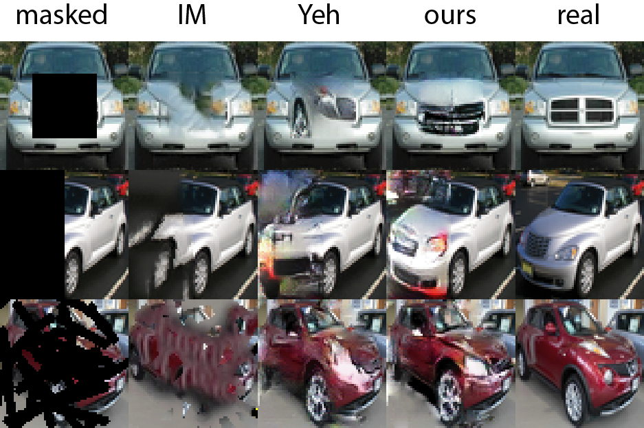
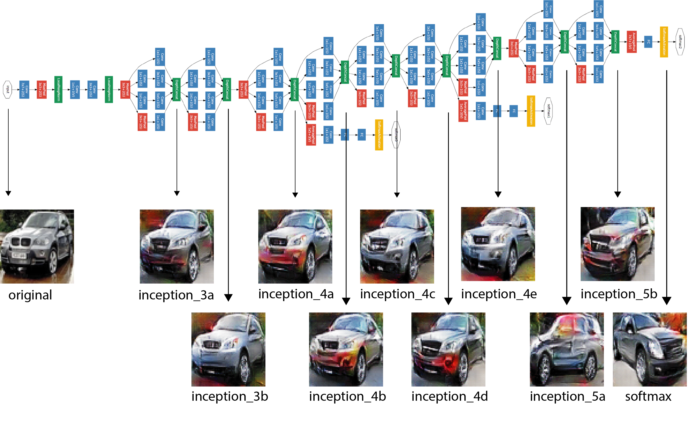
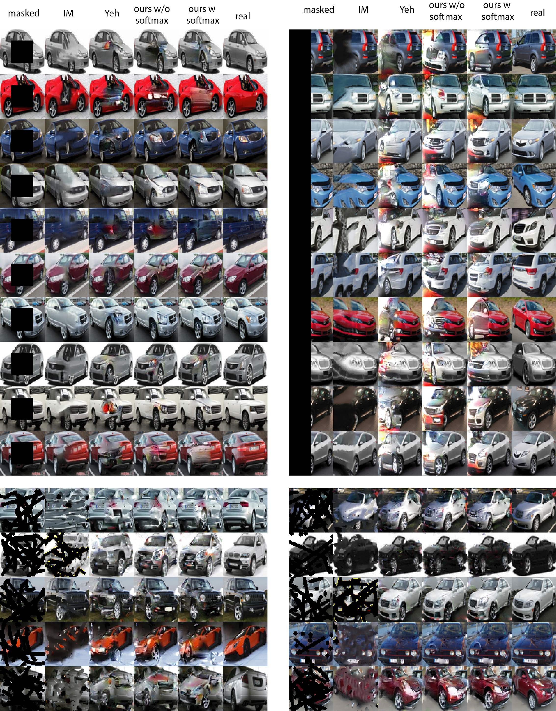

# Introduction
In this project, we present an algorithm for completing (inpainting) large missing regions or images based on deep learning and apply it to images from the Stanford Cars Dataset. Our implementation improves on the architecture by [Yeh et. al](https://arxiv.org/pdf/1607.07539.pdf). We train a _deep convolutional adversarial network_ (DCGAN) on the [Stanford cars dataset](https://ai.stanford.edu/~jkrause/cars/car_dataset.html) and use it to produce new pictures of cars. The corresponding parts of the generated pictures are then used fill the missing region. To enforce a meaningful image completion, Yeh introduced a context loss function that penalises differences between the generated and corrupted image near the boundary of the missing region. We noticed however that this algorithm does not yield convincing results when the masks large and information contained near its boundary is not sufficient, see some failure examples in the figure below. Our goal was to come up with a new algorithm that uses features contained in the whole image, and not only near the mask boundary.



<!--  -->

# Extracting features from an image classifier
We extract features relevant for cars from [GoogleNet](https://arxiv.org/pdf/1409.4842.pdf) trained on the Stanford Cars Dataset (it contains 8144 training images split into 196 different classes). Our inpainting algorithm then constraints the generated image to produce the same output in the GoogleNet hidden layers as the corrupted image. To illustrate this idea, we show below the GoogleNet architecture with various inception modules, the original image and image generated by the DCGAN that produces similar output of the inception modules. While the lower inception modules contain very detailed information about the picture and the DCGAN produces picture with almost identical shapes as the original one, reconstructing output of higher inception modules gives DCGAN more freedom. When reconstructing the output of the _softmax_ layer, picture generated by the DCGAN may look completely different from the original since it only aims to produce image that belongs to the same class.



For inpainting purposes, the original image is not known and its missing content is approximated by the output of the generator. Details about the algorithm and implementation can be found in the [documentation](./report.pdf).

# Results
We experimented with using various layers of GoogleNet and found the visually most plausible results by using output of _inception_3b_, _inception_4b_ and _softmax_ simultaneously. The picture below compares inpainting results for Image Melding (conventional algorithm not based on deep learning), Yeh's and ours implementation. In many cases, our algorithm performs better, especially on large missing regions (e.g. the left mask).

# How to run the code

## Dependencies

This repository is based on the following repositories.

https://github.com/conan7882/GoogLeNet-Inception

https://github.com/ChengBinJin/semantic-image-inpainting

Also check their READMEs in case something does not work properly.

<!-- ## Content description

```
sem_image_inpainting
├── Image_Melding                        Code for image melding
├── ...
├── googlenet_tf                         GoogLeNet deep image classifier code
│   ├── data
|   |   ├── cars                         Pickled cars data set used for training
|   |   |   ├── data_batch_1             Training data
|   |   |   ├── test_batch               Test data
|   |   ├── googlenet.npy                Pre-trained weights from training ImageNet
│   ├── examples
|   |   ├── callbacks_10                 Checkpoint of training GoogleNet with the cars data set
|   |   ├── inception_cars.py            Entry point for training GoogleNet
|   |   ├── ...
│   ├── src
│   ├── ...
├── inpaint                              Inpainting code
|   ├── src
|   |   ├── cars
|   |   |   ├── model
|   |   |   |   ├── 20190111-0942        Checkpoint of training the DCGAN with the cars data set
|   |   ├── Data
|   |   |   ├── cars                     Cars data set
|   |   |   |   ├── train                Training data                 
|   |   |   |   ├── val                  Test data
|   |   |   ├── masks_center             Center masks used for inpainting
|   |   |   ├── masks_left               Left masks used for inpainting
|   |   |   ├── masks_random             Random masks used for inpainting
|   |   ├── main.py                      Entry point for training the DCGAN
|   |   ├── inpaint_main.py              Entry point for inpainting
|   |   ├── ...
├── measure_errors.py                    Code for image quality metrics
├── README.md                            This file
``` -->

## Inpaint images

Download the weights of DCGAN trained on the cars dataset from [here](https://polybox.ethz.ch/index.php/s/qQHXspfkc4rAub7) and save them in the directory _inpaint/src/cars/model/20190111-0942_. The testing images of the Stanford Cars Dataset have been cropped and resized to 64x64 and are saved in the directory _inpaint/src/Data/cars/val_.

To test the inpainting, change to the directory _inpaint/src/_ and run

```
python inpaint_main.py --mask_type=center --layer=inception_3b --layer_2=inception_4b --num_try=10
```

The inpainted images will be stored in the directory _inpaint/src/cars/inpaint/mask_type_. The inception modules used for image reconstruction are specified by the arguments ```--layer``` and ```layer_2```. If you wish not to use the _softmax_ layer, set ```lambda_cat=0```. ```--num_try``` denotes the number of images that will be inpainted (note that inpainting one image takes approximately 100s on an NVIDIA GeForce GTX 1080 Ti). All possible arguments are defined in _inpaint_main.py_.

## Training the DCGAN

Change to the directory _inpaint/src/_ and run

```
python main.py --training=true
```

See _main.py_ for a list of possible arguments.

## Training the GoogLeNet

Change to the directory _googlenet_tf/examples_ and run

```
python inception_cars.py --train
```

See _inception_cars.py_ for a list of possible arguments.



# Acknowledgements
This project has been done together with Amaris Chen, Dejan Malesevic and Rony Speck as part of the [ETH](https://www.ethz.ch/de.html) course [Deep learning](http://da.inf.ethz.ch/teaching/2018/DeepLearning/).
